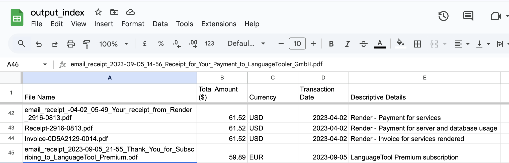

# Email to PDF to Data

Problem: I needed to file my taxes. I had many email receipts (around 330) in `.eml` format. I needed to convert them to `.pdf` format before sending them to my accountant as a link to a cloud folder.
I also wanted to extract the data from the receipts to a spreadsheet in a standard format (amount, date, purpose, contracting party, and currency). I wanted this to allow me to roughly check that my accountant found all the receipts, and to make it faster for her to understand any individual receipts.

Issues:
- My email provider (FastMail) only allows me to download the emails in `.eml` format.
- The receipts follow a non-standard format (so getting a suitable regular expressions may be difficult).

This repo:

1. Converts all email receipts (`.eml` files) to PDFs (The PDFs are largely plain text).
2. Extracts key financial data from those PDFs into a CSV file (which I can import neatly into Google Sheets)


## Files

### 1. Email to PDF Converter
- Converts `.eml` files to searchable PDFs
- Preserves email metadata (date, sender, subject)
- Creates an index PDF with all converted emails
- Handles attachments and special characters
- Command: `python convert_eml_to_pdf.py input_folder output_folder`

### 2. PDF Data Extractor
- Uses a small and cheap LLM (GPT-4o-mini) to extract financial and other data from PDFs
- Creates a standardized CSV with:
  - Transaction amounts
  - Currencies
  - Dates
  - Transaction descriptions
- Perfect for tax preparation and accounting
- Command: `python build_receipts_index.py pdf_folder output.csv`

## Example Output
The CSV output looks like this:
```csv
File Name,Total Amount ($),Currency,Transaction Date,Descriptive Details
Receipt-2566-5568.pdf,47.42,USD,2050-06-01,"Render - Servers, PostgresDB, Redis usage for May 2050"
Receipt-2952-5288.pdf,9.52,EUR,2050-03-03,Twitter International ULC - Twitter Blue subscription
```

And the imported Google Sheets looks like this:



## Quick Start

1. Clone the repository
2. Create a Python virtual environment:
   ```bash
   python -m venv venv
   source venv/bin/activate  # On Windows: venv\Scripts\activate
   ```
3. Install dependencies:
   ```bash
   pip install -r requirements.txt
   ```
4. Set up your OpenAI API key:
   - Copy `.example.env` to `.env`
   - Add your API key: `OPENAI_API_KEY=your-key-here`

5. Run either script:
   ```bash
   # Convert emails to PDFs
   python convert_eml_to_pdf.py ./email_folder ./pdf_folder

   # Extract data from PDFs
   python build_receipts_index.py ./pdf_folder output.csv
   ```

## Requirements
- OpenAI API key (for PDF data extraction)
- Dependencies listed in `requirements.txt`

## Use Cases
- Generally converting `.eml` files to PDFs
- Tax preparation
- Expense tracking
- Accounting reconciliation
- Digital receipt organization
- Audit preparation
